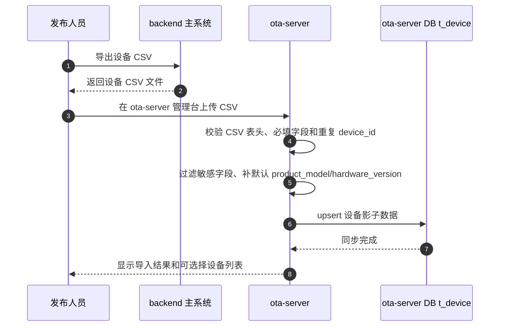
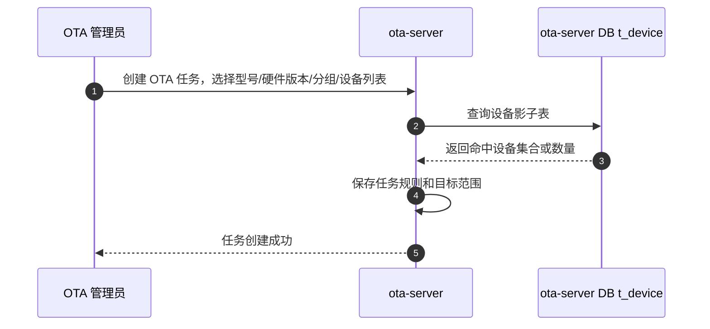
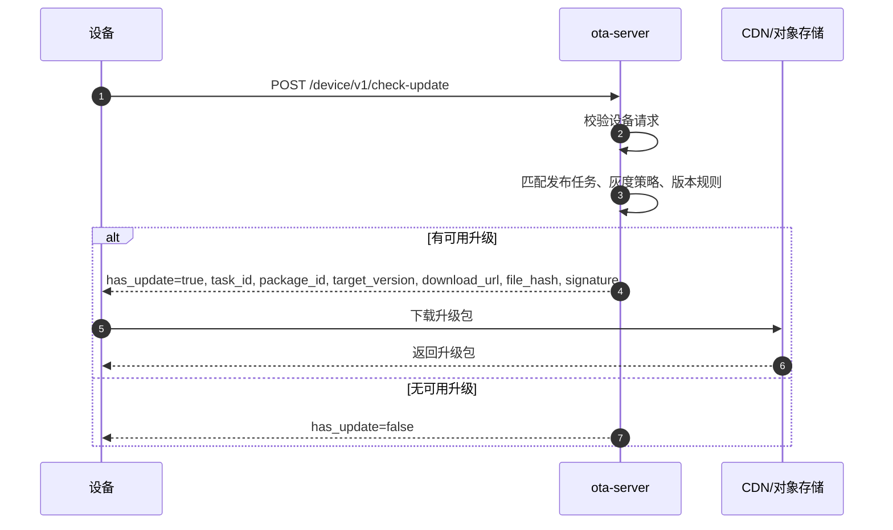
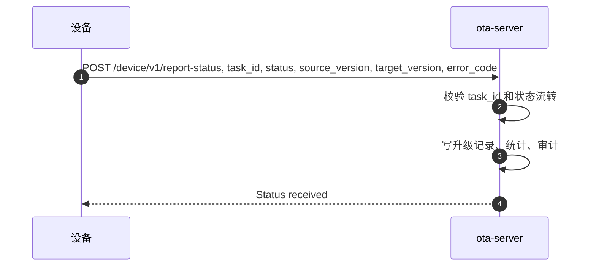
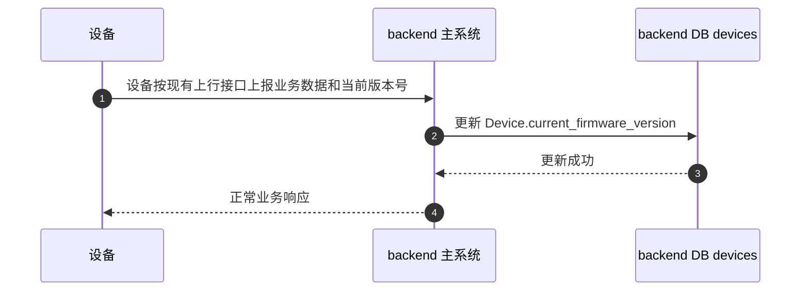
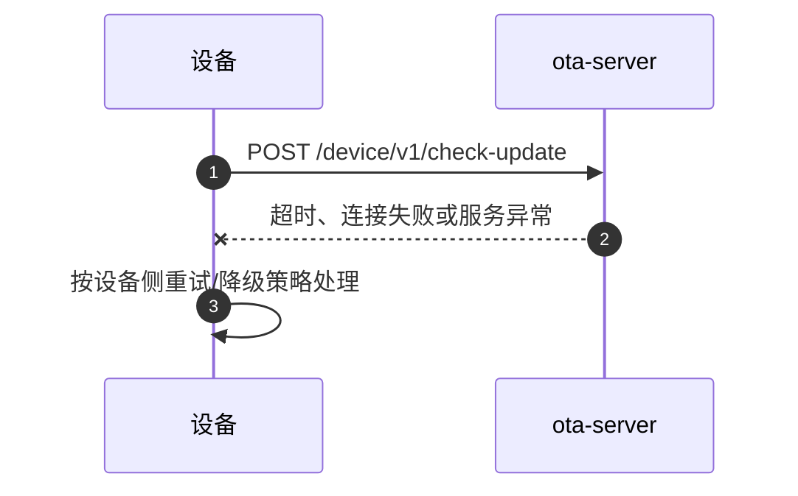

# 第三方 OTA 服务接入架构 Proposal

## 1. 最终结论

最终方案调整为：

1. 设备直连 `ota-server` 完成 OTA 全流程。
2. 主系统 `backend` 不再提供任何 OTA 专用接口。
3. 主系统不再代理 OTA 请求，不再调用 OTA，不再接 OTA 回调。
4. 主系统只继续保存设备自身上报的当前固件版本摘要，例如 `Device.current_firmware_version`。

因此，`ota-server` 和 `backend` 的关系不是“集成关系”，而是“彼此独立、设备同时接入的两个系统”。

## 2. OTA 和主系统的关系

### 2.1 关系定义

`ota-server` 和 `backend` 现在的关系应定义为：

- `ota-server`：独立第三方 OTA 服务，只负责升级域。
- `backend`：主系统，只负责业务域。
- `device`：同时接入这两个系统。

也就是说：

1. 设备找 `ota-server` 检查升级、下载升级包、上报升级结果。
2. 设备找 `backend` 上报业务数据、在线状态、当前固件版本。
3. `ota-server` 不依赖 `backend`。
4. `backend` 不依赖 `ota-server`。

### 2.2 职责边界

| 能力 | backend 主系统 | ota-server |
| --- | --- | --- |
| 设备主数据 | 负责 | 不负责 |
| 用户、组织、权限 | 负责 | 不负责 |
| 业务事件、告警、业务接口 | 负责 | 不负责 |
| 固件/App 包管理 | 不负责 | 负责 |
| 升级任务、灰度、回滚 | 不负责 | 负责 |
| 升级状态、统计、审计 | 不负责 | 负责 |
| 当前固件版本摘要 | 记录设备上报结果 | 不要求同步给 backend |

## 3. 推荐架构

```text
                +----------------------+
                |      ota-server      |
                |  检查升级/下载/上报  |
                +----------^-----------+
                           |
                           |
                         设备
                           |
                           |
                +----------v-----------+
                |       backend        |
                |  业务接口/设备主数据 |
                +----------------------+
```

关键点：

1. 设备分别调用 `ota-server` 和 `backend`。
2. `backend` 不在 OTA 调用链路上。
3. `backend` 不再保留 `/api/device-firmware/*` 这类 OTA 专用入口。
4. 设备当前版本号仍按现有设备上报链路写回主系统。

## 4. CSV 设备清单与覆盖范围选择

设备直连 `ota-server` 只解决升级链路。创建 OTA 任务时要选择哪些设备被覆盖，`ota-server` 需要一份设备清单。

为避免系统间接口对接、鉴权、字段兼容和多设备平台统一抽象，首期不做 `backend` 与 `ota-server` 的在线设备目录同步，改为 CSV 导入导出：

1. 主系统按需导出设备 CSV。
2. 运营或发布人员在 `ota-server` 导入 CSV。
3. `ota-server` 将 CSV 内容保存为设备影子表。
4. 创建 OTA 任务时，只从 `ota-server` 本地设备影子表里选设备。
5. OTA 任务执行时，设备直接访问 `ota-server`，不访问 `backend`。

### 4.1 CSV 字段

CSV 只包含 OTA 选择和匹配需要的字段。建议最小字段：

```csv
device_id,product_code,product_model,hardware_version,current_version,device_group,tags
AMS000001,AMS,V9,1.0,v2.3,org-1001,"{\"batch\":\"2026-05\"}"
```

字段含义：

| 字段 | 来源 | 用途 |
| --- | --- | --- |
| device_id | backend.devices.sn | 跨系统设备标识 |
| product_code | 默认配置或设备配置 | 产品线筛选 |
| product_model | 设备配置或默认值 | 型号筛选 |
| hardware_version | 设备配置或默认值 | 硬件版本筛选 |
| current_version | 设备上报到主系统的当前固件版本 | 升级条件判断 |
| device_group | organization_id、平台、批次或默认分组 | 任务覆盖范围 |
| tags | 非敏感标签 | 灰度和筛选 |

不应该同步到 `ota-server` 的字段：

1. 机主姓名。
2. 手机号。
3. 详细地址。
4. 紧急联系人。
5. 跌倒事件、图片、骨架数据等业务数据。

### 4.2 主系统提供什么

主系统不需要提供 OTA 对接接口。

主系统只需要保留一个人工或后台使用的设备清单导出能力，可以是：

1. 现有设备列表页面导出 CSV。
2. 管理脚本导出 CSV。
3. 数据库只读报表导出 CSV。

这个导出不属于 OTA 运行时链路。导出的 CSV 只是给 `ota-server` 管理台导入使用。

### 4.3 ota-server 怎么选设备

创建 OTA 任务时，`ota-server` 只基于自己的设备影子表做筛选。

常见筛选条件：

1. 产品线。
2. 设备型号。
3. 硬件版本。
4. 当前固件版本。
5. 机构/平台/批次标签。
6. 手动选择设备 SN 列表。
7. 灰度比例。

任务创建后，`ota-server` 应冻结或记录当时的目标规则/目标快照，避免设备目录后续变化导致任务覆盖范围不可追溯。

### 4.4 CSV 导入设备清单时序图



### 4.5 创建 OTA 任务选择设备时序图



说明：

1. 创建任务时不实时调用 `backend`。
2. `backend` 不参与 OTA 任务决策。
3. CSV 未导入或导入过旧，只影响管理台可选设备的新鲜度，不影响已下发任务的设备升级链路。

## 5. backend 要怎么改

### 5.1 直接删除旧 OTA 接口

主系统中原有的 OTA 专用接口直接删除，不保留兼容层：

```text
/api/device-firmware/latest
/api/device-firmware/upgrade-success
以及同类 OTA 专用接口
```

### 5.2 主系统不新增 OTA 集成层

主系统不需要：

1. OTA SDK
2. OTA adapter
3. OTA client
4. OTA webhook
5. OTA token 配置
6. OTA 任务同步逻辑

也就是说，主系统现在不需要关心 OTA。

### 5.3 保留版本摘要字段

主系统只保留设备模型中的当前固件版本摘要字段，例如：

```text
Device.current_firmware_version
```

这个字段的来源不是 `ota-server` 回调，而是设备按现状通过主系统已有上行接口自己上报。

## 6. ota-server 要怎么改

`ota-server` 需要承担完整设备 OTA 流程：

1. 设备检查升级
2. 返回 `task_id`
3. 返回 `package_id`
4. 返回 `target_version`
5. 返回 `download_url`
6. 返回 `file_hash`
7. 返回 `signature`
8. 接收设备升级状态上报
9. 记录升级审计、统计、失败原因

此外，`ota-server` 还需要支持 CSV 导入设备影子表，用于管理台创建任务时选择覆盖范围。

因此，`ota-server` 必须是设备 OTA 的唯一服务端，也是 OTA 任务覆盖范围计算的系统。

## 7. 关键时序图

### 7.1 设备检查升级



### 7.2 设备上报升级结果



### 7.3 设备向主系统上报当前版本



说明：

1. 这里不是 OTA 接口。
2. 这里沿用设备和主系统之间现有的上报链路。
3. 主系统只把当前固件版本当作设备状态摘要保存。

### 7.4 ota-server 不可用



说明：

1. 这时不经过 `backend`。
2. `backend` 不承担 OTA 降级逻辑。
3. OTA 故障由设备侧和 OTA 自身运维处理。

## 8. 设备端约束

设备 OTA 逻辑必须满足：

1. 直接调用 `ota-server` 的 `/device/v1/check-update`。
2. 保存 `task_id`。
3. 下载 OTA 包后执行升级。
4. 调用 `ota-server` 的 `/device/v1/report-status` 上报结果。
5. 继续按现状向主系统上报当前固件版本。

## 9. backend 的最终定位

主系统 `backend` 的最终定位是：

1. 不提供 OTA 专用接口。
2. 不提供 OTA SDK 集成层。
3. 不代理 OTA。
4. 不处理 OTA 回调。
5. 不保存 OTA 任务、包、升级记录。
6. 只保存设备自身上报的当前固件版本摘要。
7. 可按需导出设备 CSV，供外部系统离线导入。

## 10. ota-server 的最终定位

`ota-server` 的最终定位是：

1. 独立第三方 OTA 服务。
2. 设备 OTA 唯一服务端。
3. 升级任务、包、状态、统计、回滚、审计的唯一权威系统。
4. 不依赖主系统运行。
5. 保存 CSV 导入的 OTA 影子设备数据，用于任务覆盖范围选择。

## 11. 实施步骤

### 阶段 1

1. 在 `ota-server` 完成设备侧 OTA 接口。
2. 设备改为直连 `ota-server`。
3. 设备保存并回传 `task_id`。
4. `ota-server` 支持 CSV 导入设备清单。

### 阶段 2

1. 从主系统删除旧 OTA 接口。
2. 主系统不再保留任何 OTA 调用逻辑。

### 阶段 3

1. 设备继续按现状向主系统上报当前版本号。
2. 主系统继续更新 `Device.current_firmware_version`。

## 12. 不做事项

为保持边界清晰，明确不做：

1. 不做 `backend -> ota-server` 代理调用。
2. 不做 OTA SDK 给主系统集成。
3. 不做 OTA webhook 回写主系统。
4. 不做 OTA 任务同步到主系统。
5. 不做 OTA 包同步到主系统。
6. 不让主系统保存 OTA 审计和 OTA 升级记录。
7. 不让 `backend` 关心 OTA 运行时逻辑。
8. 不做 `ota-server` 在线拉取主系统设备目录。
9. 不把主系统敏感业务数据导入到 `ota-server`。

## 13. 一句话总结

最终关系就是：

**设备直接接 ota-server 做 OTA，设备继续接 backend 做业务；ota-server 和 backend 互不调用、互不依赖。**
